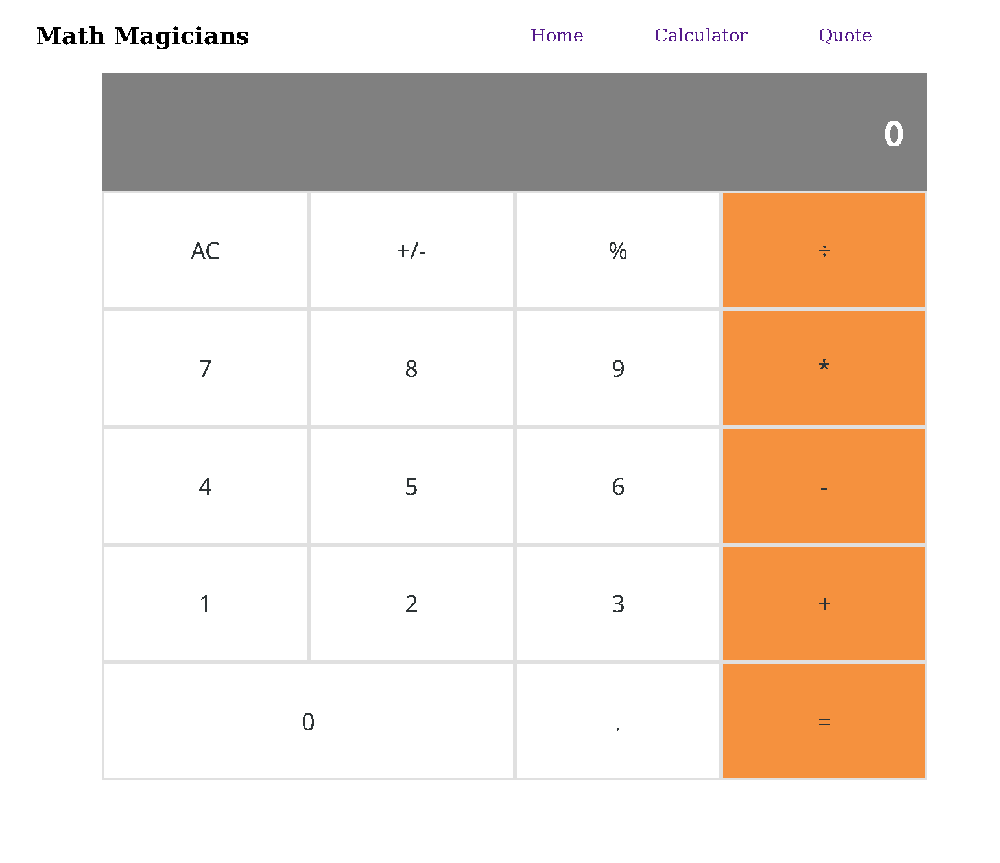

# REACT CALC

The React Calc App is able to perform basic calculations. After inputting a value, an operator, and another value it will display the result of the calculation.
Since this project is focused on practicing state and props available to a react component class, it is not using hooks and utilizes only minimal CSS styling.

## BUILT WITH
- JavaScript
- Sass
- NPM
- React
- React-Create-App

## Live Demo
[LIVE APP](https://react-calc-zil.herokuapp.com/)

## Getting Started Locally
Prerequisities

To run this project locally, you must have node and npm installed on your machine.

To set up this project on your local machine:

Navigate to the folder where you want the repository to be copied and run 

`git clone https://github.com/zilton7/react-calc.git`

Navigate to the directory :

`cd react-calc`

To start the server: 

`npm start`

Go to http://localhost:3000/ in your browser to see the application running

## Author

**ZIL NORVILIS**
- Github: 
- Linkedin: 
- Twitter: 
- 
## 🤝 Contributing

Contributions, issues, and feature requests are welcome!

Feel free to check the [issues page](../../issues/).

## Show your support

Give a ⭐️ if you like this project!

## Acknowledgments

- Hat tip to anyone whose code was used
- Inspiration
- etc

## 📝 License

This project is [MIT](./MIT.md) licensed.
